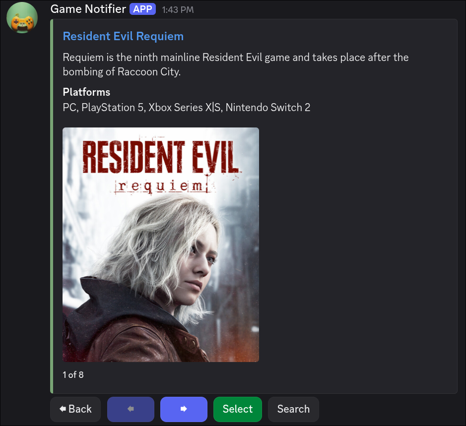
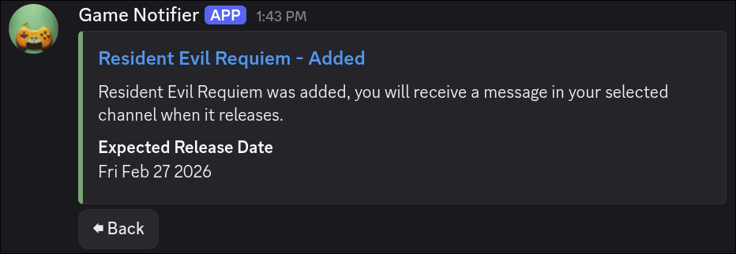
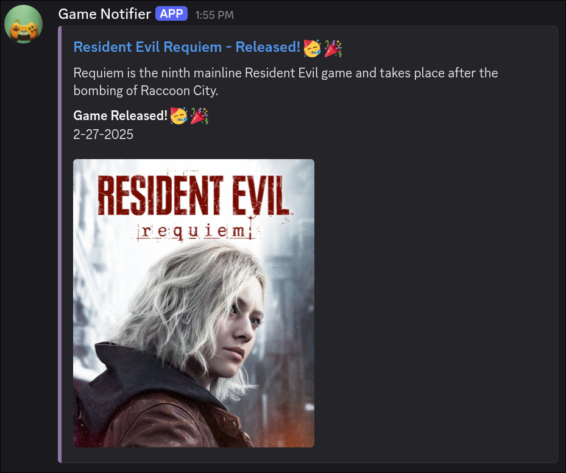

# Game Release Notifier Bot
Track game releases. All inclusive discord bot acts as a full app you can add, search, view and get notified of released games. Currently uses giantbomb api for game data. 
built for sqlite3 only no orm cross db support. I wanted to make a full proper notifier app and the challenge of working within discord.js more limited scope was fun but also I think suited the project better 
as the end goal of this is to be alerted of unreleased games.

This was built with [Discord.js](https://github.com/discordjs/discord.js), [SQLite3](https://www.npmjs.com/package/sqlite3), [Node-Cron](https://github.com/kelektiv/node-cron), [Typescript](https://github.com/microsoft/TypeScript)

## Screenshots

- Search for games to add.

*Uses giantbomb api, limited 10 results max per search*

- Add games your interested in.

*Some games won't have a release date, games will update once they get a release date*

- Get notified when they release!

*Releases send in selected channel selected in settings*

## Docker
- Build
    1. `git clone https://github.com/UnderscoreOfficial/game-release-notifier-bot.git`
    2. `docker build -t game-release-notifier-bot:1.0 .`
- Load
    1. Download the [latest release](https://github.com/UnderscoreOfficial/game-release-notifier-bot/releases)
    2. `docker load -i <release_name.tar>`

## Docker Compose
- docker compose example:
```
services:
  game-release-notifier-bot:
    image: game-release-notifier-bot:1.0
    container_name: game-release-notifier-bot
    volumes:
      - your_local_database_folder:/app/database
    # all enviroment variables are required
    environment:
      - API_KEY=#your_giantbomb_api_key
      - DISCORD_TOKEN=#your_discord_token
      - GUILD_ID=#your_server_id  #will be changed, only 1 server can be added.
      - CLIENT_ID=#your_client_id
    restart: always
```
- compose file should be .yaml can be named anything.
-`docker compose -f <file_name.yaml> up -d`

